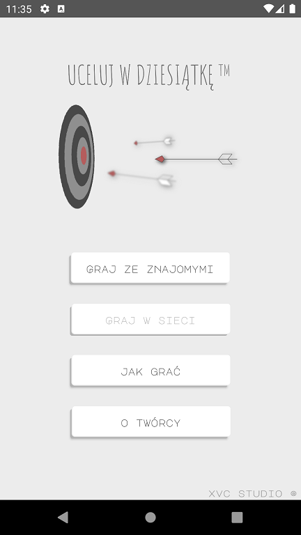
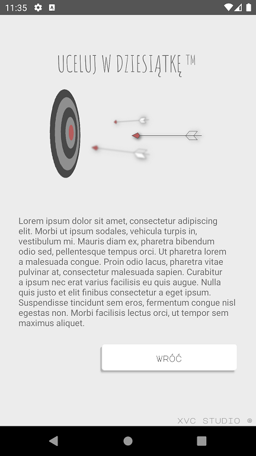
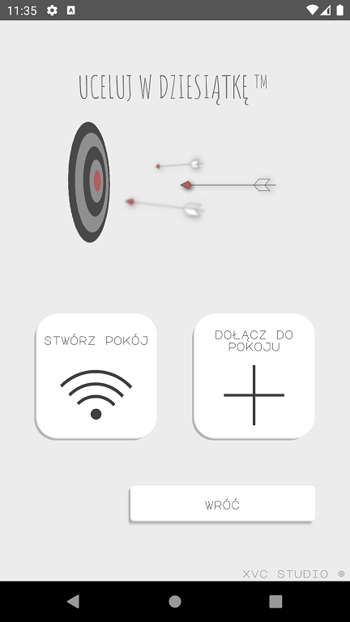
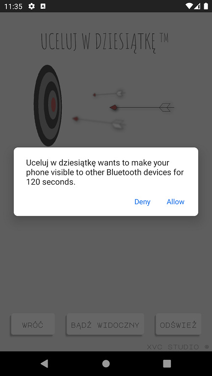
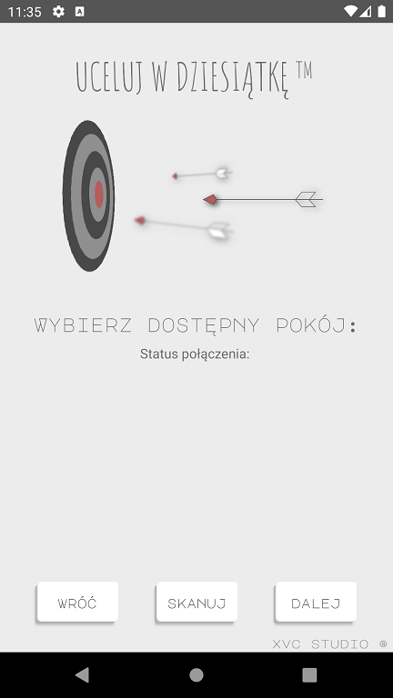
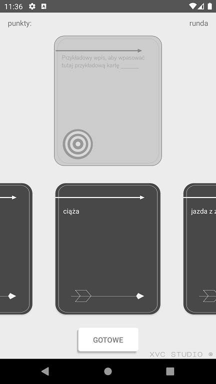

 # Uceluj w dziesiątkę
> *Asynchronous* mobile game for **android**.

## Game

**Uceluj w dziesiątkę** is a party game in which players complete fill-in-the-blank statements using words or phrases typically deemed as incorrect, showed on your smartphone. 

## Gameplay

> ### Main menu
>
>
>
>___
> ### About author 
> *empty*
>
>
>___
> ### Join to room
>
>
>
>___
> ### Name the room
>
>
>
>___
> ### Switch on bluetooth
>
>
>
>___
> ### Choose room
>
>
>
>___
> ### Game - match the card!
>
>
>

## Progress

## Author
Leśniewski Paweł 2020, xvc_studio ©
